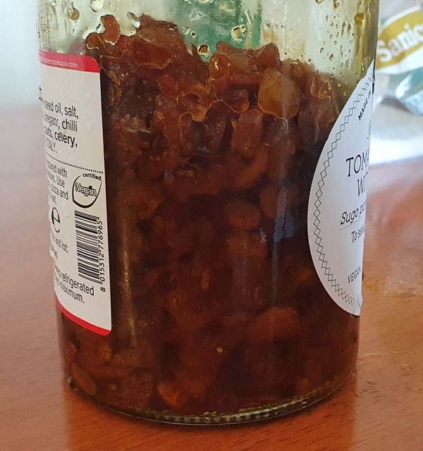

# Crispy Garlic Reaper Oil

This recipe is for an extremely spicy crispy garlic oil. You can make it less spicy by replacing the Carolina reapers with a less spicy pepper of your liking.

## Ingredients

- Extra virgin olive oil
- 10 bulbs of garlic
- 20 Carolina reapers, replace with less hot peppers if you want it less hot
- Fresh turmeric
- Fresh ginger

1. Peel garlic without crushing it.
2. Slice the garlic into slices of even thickness about 1-2mm thick.
3. Chop Carolina reapers into slices, use gloves unless you want burning hands.
4. Chop a small amount of fresh turmeric into slices. I recommend you don't use powdered turmeric as it will not dissolve in the oil and will be hard to filter out creating a gritty texture.
5. Chop a larger amount of fresh ginger into slices.
6. Cover the garlic with enough oil to cover them once they are cooked. This will not be enough to cover them when raw, account for them shrinking. The goal is to have just enough oil to cover the garlic once they are finished cooking.
7. Cook garlic on low to medium heat until the garlic is brown and most water has been driven out. The bubbling should be almost stopped. To test if it is crispy take a bit out and let it cool, as it will not be crispy when hot even if done. Do not burn.
8. Strain the garlic out and set aside.
9. Place the reapers, ginger, and turmeric into the same oil the garlic was cooked in. Cook slowly until the reapers have darkened and start to get crispy.
10. Strain the reapers, ginger, and turmeric out and discard or use in another recipe.
11. Reintroduce the garlic to the oil.

If you correctly cooked the water out of the garlic and strained out the other solids then this sauce should last at room temperature for several weeks. It will stay fresher longer in the fridge but the oil may solidify.

Handle with care, this sauce is very hot. Just a little is enough.

